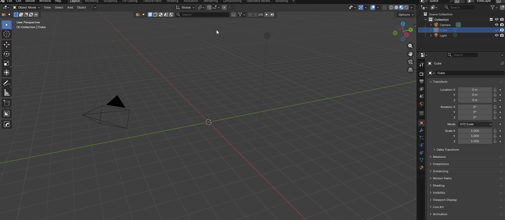
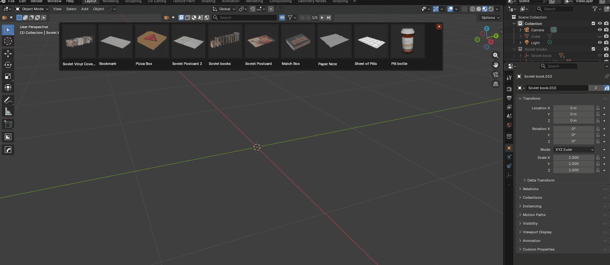
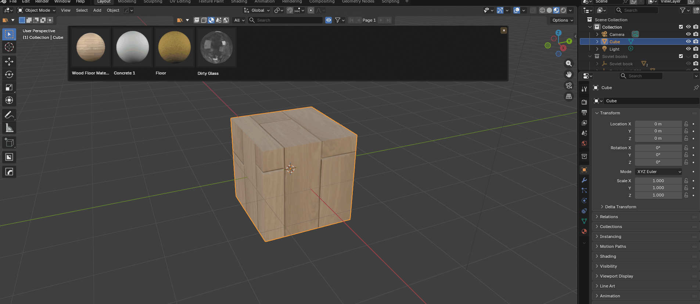

<h1 align="center">Blendflare Asset Browser</h1>

<p align="center">
  
</p>
<p align="center">
  <strong>Search, download, and import 3D assets from <a href="https://blendflare.com">blendflare.com</a> directly inside Blender.</strong>
</p>

<p align="center">
  <a href="https://blendflare.com">Website</a> &bull;
  <a href="https://docs.blendflare.com">Documentation</a> &bull;
  <a href="https://github.com/blendflare/blendflare-python-sdk">Python SDK</a>
</p>


The Blendflare Asset Browser is a powerful addon designed to streamline your 3D workflow. It brings the entire Blendflare library into your viewport, allowing you to insert Models, Materials, HDRIs, and Scenes without ever leaving your project.

## Demo

### 3D Models
Import models directly at your 3D cursor with automatic hierarchy setup.

<p align="center">
  
</p>

### Materials
Apply materials to selected objects with automatic texture packing.

<p align="center">
  
</p>

### HDRIs
Set up environment lighting with a few clicks.

<p align="center">
  
</p>

Test HDRI from [AmbientCG](https://ambientcg.com) licensed under the Creative Commons CC0 1.0 Universal License. [HDRI Link](https://ambientcg.com/view?id=DaySkyHDRI055B) 

### Scenes
Import complete scenes with render settings, compositing nodes, and World setup.

<p align="center">
  
</p>


## Key Features

* **Integrated Toolbar**: A seamless toolbar integrated into the 3D Viewport header. Toggle it on/off to keep your workspace clean.

* **Smart Asset Application**:
  * **3D Models**: Automatically imported, parented to an Empty, and placed at your 3D cursor.
  * **Materials**: Auto-applied to selected objects with texture relinking and packing.
  * **HDRIs**: Instantly sets up your World nodes with the correct environment texture.
  * **Scenes**: Appends full scene collections, including render settings and compositing nodes.

* **Asset Browser Integration**: All imported assets are automatically marked as Blender assets, making them available in the native Asset Browser for easy reuse.

* **Advanced Search & Filtering**:
  * Filter by **Category** (Architecture, Characters, Nature, etc.).
  * Filter by **Render Engine** (Cycles, Eevee), **License** (CC0, CC-BY), **Poly Count**, and **Blender Version**.

* **Detailed Hover Cards**: Preview assets before downloading. Hover over a thumbnail to see:
  * Full resolution preview.
  * Author details & Avatar.
  * File size, polygon count, and license type.

* **Smart Caching**: Downloaded assets are cached locally. If you use the same asset in a different project, it loads instantly from your disk.

* **Security First**: Includes a built-in **Blend File Sanitizer**. Before importing, the addon runs a background process to strip potentially malicious scripts and unsafe drivers from downloaded files.


## Open Ecosystem & Developer SDK

This addon was developed not only as a tool for artists but also as a **reference implementation** to validate the integration of the **[Blendflare Python SDK](https://github.com/blendflare/blendflare-python-sdk)** within production environments.

Our API is **not closed**. We believe in empowering developers to build their own tools on top of our platform.

### Why Build with Blendflare?

* **Extensibility**: While this addon covers the main filters, the API and SDK support even more advanced queries and filtering options.
* **Custom Addons**: You can use the SDK to create bespoke addons tailored to specific use cases for your studio or workflow.
* **Scripting & Automation**: The SDK can be installed globally (`pip install blendflare`) outside of Blender. This allows for the creation of automation scripts, search pipelines, or standalone asset management tools.

### Developer Resources

| Resource | Link |
|----------|------|
| General Documentation | [docs.blendflare.com](https://docs.blendflare.com/) |
| API Reference | [docs.blendflare.com/reference/api](https://docs.blendflare.com/reference/api) |
| Python SDK | [github.com/blendflare/blendflare-python-sdk](https://github.com/blendflare/blendflare-python-sdk) |

We invite the community to explore the SDK and build their own integrations!


## Installation

### Requirements

* **Blender 4.2.0** or higher (tested up to Blender 5.0)
* An account at [blendflare.com](https://blendflare.com)
* API Key from your Blendflare account

### Steps

1. Download the latest release (`.zip` file) from the [Releases page](#).
2. Open Blender.
3. Go to **Edit** > **Preferences**.
4. Select the **Get Extensions** (or **Add-ons**) tab.
5. Click the arrow icon (top right) and select **Install from Disk...**.
6. Select the downloaded `.zip` file.
7. Ensure the addon is enabled (checked).

### Using with BlenderKit

If you also use the BlenderKit addon, please note the following for proper toolbar compatibility:

> **Enable BlenderKit first, then enable Blendflare.**

Both addons modify the 3D Viewport header to display their toolbars. Blendflare is designed to preserve existing header modifications, allowing you to switch between toolbars seamlessly. However, for this to work correctly, BlenderKit must be enabled before Blendflare.

If you experience issues with the toolbar not appearing, try disabling both addons, then re-enabling them in the correct order (BlenderKit first, Blendflare second).


## Configuration (API Key)

To access the library, you need to link the addon to your Blendflare account.

1. Log in to your account at [blendflare.com](https://blendflare.com).
2. Navigate to **Settings** > **[API Keys](https://blendflare.com/dashboard/settings/api-keys)**.
3. Generate a new API Key and copy it (starts with `sk_live_...`).
4. In Blender, go to **Edit** > **Preferences** > **Add-ons**.
5. Search for **Blendflare Asset Browser** and expand the preferences.
6. Paste your key into the **Blendflare API Key** field.
7. *(Optional)* Enter your **Blendflare Nickname** to easily filter for your own assets using the "My Assets" button.
8. *(Optional)* Set a custom **Cache Directory** if you want assets stored in a specific drive.


## Usage Guide

### The Interface

Once installed, you will see the Blendflare logo icon in the top header of the **3D Viewport**.

* **Click the Logo**: Toggles the Blendflare Toolbar.
* **Panel Toggle**: Click the "Eye" icon in the toolbar to open/close the main asset grid panel.

### Searching and Importing

1. Select a category (Cube icon for Models, Sphere for Materials, World for HDRIs, etc.).
2. Use the dropdown to select specific subcategories (e.g., *Architecture > Building*).
3. Type keywords in the search bar.
4. **Click** on an asset card to download and import it into your scene.

### Filters

Click the **Filter** icon to access advanced options:

* **License Type**: Find CC0 (Public Domain) assets.
* **Render Engine**: Ensure materials work with your engine (Cycles/Eevee).
* **Blender Version**: Filter assets compatible with your version.


## Security & Sanitization

We take security seriously. When you download a `.blend` file from the internet, it can theoretically contain malicious Python scripts.

The Blendflare Asset Browser includes a **Sandbox Sanitizer**. When an asset is downloaded:

1. Blender launches a background subprocess.
2. It opens the file in a restricted mode.
3. It removes all Text datablocks (scripts) and checks for dangerous Python drivers.
4. Only the clean, safe data is imported into your open project.


## Development

This addon is built using the official **Blendflare Python SDK** (`blendflare-python-sdk`), which handles API communication, type validation, and data modeling.

### Build from Source

If you want to modify the code:

1. Clone this repository.
2. Ensure you have the `blendflare` SDK wheel in `src/wheels/`.
3. Run the build command (requires Blender 4.2+):

```bash
blender --command extension build --source-dir=./src --output-dir=./build
```


## License

This project is licensed under the **GPL-3.0-or-later** license.

---

<p align="center">
  <sub>Developed by the <a href="https://blendflare.com">Blendflare</a> Team</sub>
</p>
